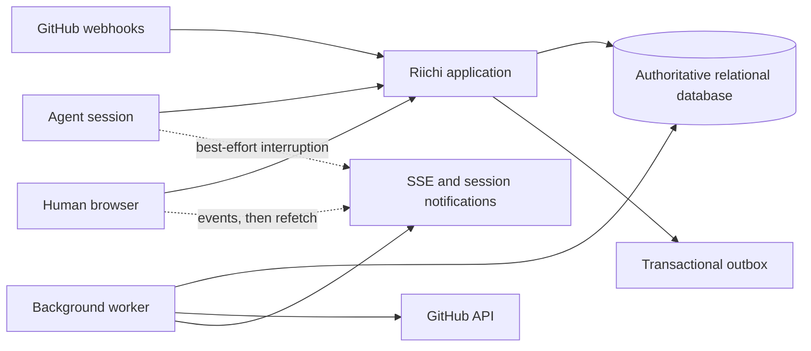

# Riichi pilot architecture RFC

**Status:** proposed, working stack selected
**Scope:** architecture for the pilot PRD, not the long-term platform
**Related:** [pilot PRD](./riichi-pilot-prd.md)

## 1. Decision summary

Build the pilot as a modular monolith with one background worker process:

- a web/API application owns authorization, current state, agent intentions, and the human control surface;
- a relational database owns authoritative workspace, issue, lease, approval, audit, idempotency, and outbox state;
- a worker handles lease expiry, notifications, context work that is safe to defer, GitHub delivery, and retries;
- agents use a small HTTP contract, with CLI and MCP wrappers calling the same application operations;
- the browser uses server-authoritative reads and mutations, with server-sent events for hints and refetches;
- GitHub integration is an adapter, not a second source of Riichi dispatch truth.

This is intentionally one deployable product. The lease and authorization invariants cross too many boundaries for microservices to be a useful first move.

## 2. Architecture shape



### Request path

The application authenticates the caller, resolves the workspace, authorizes the operation, and executes the relevant transaction. It returns the authoritative result or a typed rejection. It does not trust a client-side eligibility decision.

### Worker path

The worker claims durable jobs from the outbox or scheduled work tables. Every job is idempotent. A failed delivery remains visible with retry state rather than disappearing into an in-memory queue.

### Notification path

Notifications improve responsiveness but never carry authority. A browser or agent can miss an event and recover by refetching from the server. Lease expiry, approval, and mutation correctness do not depend on an SSE connection.

## 3. Explicit architectural decisions

### ADR-01: modular monolith first

Keep API handlers, domain operations, authorization, persistence, and integration adapters in one application boundary. Separate modules by domain:

- identity and workspaces;
- issues, relationships, holds, and dispatch projection;
- leases, sessions, delegation, and takeover;
- context construction;
- reports and approvals;
- audit, idempotency, and outbox;
- GitHub integration;
- human read models and notifications.

Modules may share a database transaction through explicit domain operations. They should not reach into each other's tables through ad hoc queries.

### ADR-02: relational current state plus append-only audit

Use a transactional relational database for current state. Keep the audit log append-only and the outbox transactional. Do not make full event sourcing a pilot prerequisite.

The database must support:

- row-level locking or equivalent transactional arbitration;
- unique constraints for lease, idempotency, and webhook delivery invariants;
- indexed workspace-scoped queries;
- durable timestamps and optimistic versions;
- backup and restore procedures suitable for pilot data.

PostgreSQL is the working default because the pilot needs relational joins, conditional writes, JSON payloads for bounded external data, and strong transactional semantics. The application should avoid PostgreSQL-specific behavior in domain code until the choice is confirmed.

### ADR-03: synchronous correctness, asynchronous side effects

A command transaction writes authoritative state, an audit record, and required outbox messages together. External calls, notifications, summaries, and retries happen after commit.

No GitHub request, model request, email, or browser notification may be required to commit a claim or report.

### ADR-04: REST semantics with thin adapters

Expose the four agent intentions as stable application operations:

- `ready`;
- `claim`;
- `context`;
- `report`.

The initial HTTP surface may have ordinary resource endpoints for humans and integrations, but the agent contract stays small. CLI and MCP wrappers call the same operations. They do not each invent different authorization or lease behavior.

### ADR-05: server-sent events before bidirectional realtime

Use SSE for browser changes and best-effort session notifications. Events carry an event ID and workspace cursor. Clients refetch authoritative queries after receiving an event.

Human notifications are persisted in the `notifications` read model. The Inbox
API owns unread and read state; SSE remains only a refresh hint.

WebSockets, presence, collaborative editing, and offline writes are outside the pilot.

### ADR-06: working implementation stack

The pilot's working stack is:

- **Backend:** Rust workspace using Tokio and Axum for the application boundary.
- **Persistence:** PostgreSQL through SQLx, with migrations kept in the repository.
- **Process model:** API and worker are separate processes built from the same workspace and deployable from the same container image. Local development may run PostgreSQL in the same development container; production should use a managed PostgreSQL service when the pilot needs durable external hosting.
- **Worker:** PostgreSQL-backed outbox and scheduled polling. Do not add Redis or a separate queue until measurements require it.
- **GitHub:** an HTTP client and signed webhook adapter in its own integration crate.
- **Human auth:** OAuth2/OIDC through an external identity provider, using authorization code with PKCE. Development targets Pocket ID through its standard OIDC issuer and discovery URL; production can point at the user's own provider. The backend exchanges the code and establishes a secure, HttpOnly application session; browser code does not store provider access tokens in local storage.
- **Frontend:** React and TypeScript SPA with TanStack Router, TanStack Query for server state, shadcn/ui, and Tailwind CSS.
- **Browser updates:** SSE events invalidate or refresh TanStack Query data. The browser does not maintain an authoritative local replica.
- **API types:** generate an OpenAPI description from Rust handlers with `utoipa`, generate TypeScript types with `openapi-typescript`, and use `openapi-fetch` for the typed web client. These are working defaults, not runtime dependencies of the domain layer.
- **Configuration:** read configuration from environment variables. Local development uses `.env`-style injection without committing secrets; deployment can later use Vault or another secret manager to populate the same variables.

Suggested repository shape:

```text
apps/api
apps/worker
web/
crates/domain
crates/application
crates/persistence
crates/auth
crates/integrations-github
```

The crate boundaries are a maintainability aid inside one product, not a promise that each crate becomes an independently deployable service.

### ADR-07: testability is an architecture constraint

Critical behavior must be testable without starting the whole product:

- domain rules are pure and do not read the database, environment, clock, or random generators;
- application services depend on explicit repository and side-effect boundaries;
- time and ID generation are injectable where they affect decisions or assertions;
- persistence behavior has real PostgreSQL integration tests for locking, constraints, migrations, and transaction outcomes;
- API tests exercise serialized requests and response status, while service tests cover behavior without HTTP;
- external integrations use recorded payload fixtures and contract tests at the adapter boundary, never hidden network calls in unit tests.

The test suite should make the failure mode obvious: a pure rule failure belongs in a fast unit test; a transaction or SQL failure belongs in a real database test; a transport failure belongs in an API test.

## 4. Authoritative data model

Every workspace-owned table carries `workspace_id`, and every query begins with an enforced workspace scope. Important tables are:

- `workspaces` and `memberships`;
- `agent_roles`, `agent_credentials`, and `sessions`;
- `issues`, `issue_labels`, and `issue_versions`;
- `issue_edges` for `blocks`, `related`, `discovered_from`, and `duplicate_of`;
- `dispatch_holds`;
- `issue_dispatch` for the synchronously maintained eligibility projection;
- `leases` and `lease_collaborators`;
- `approval_requests`;
- `comments` and bounded activity records;
- `external_links` and `external_issue_snapshots`;
- `audit_records`;
- `idempotency_records`;
- `outbox_messages`;
- `quarantined_attempts`;
- `recovery_checklists` and `recovery_actions`.

### Dispatch projection

Do not rely on an unbounded graph query during claim arbitration. Maintain the fixed eligibility facts transactionally in `issue_dispatch`, including:

- `agent_eligible`;
- `spec_complete`;
- unresolved blocker count;
- active hold count;
- active lease ID, if any;
- rank and rank scope;
- dispatch version.

Changes to issue status, specification, holds, or blocking edges update this projection in the same transaction. If a projection is inconsistent or unavailable, `ready` fails closed and an operator-visible repair job is created.

## 5. Critical transaction flows

### Claim

`claim` runs as one transaction:

1. authenticate the session and resolve its workspace and capabilities;
2. acquire the issue's arbitration lock;
3. expire an already-expired active lease if necessary;
4. re-evaluate the fixed dispatch projection and caller scope;
5. increment the issue's fencing token;
6. create the lease with owner session, TTL, and expiry;
7. change `todo` to `in_progress`;
8. write audit and outbox records;
9. store and return the idempotent result.

The transaction must retry safely on serialization or deadlock errors. The loser of concurrent claims receives a typed contention or ineligibility result, never a partially created lease.

### Renewal

Renewal locks the lease and issue, verifies the session, lease ID, fencing token, and maximum session lifetime, then advances the heartbeat and expiry. It cannot extend beyond the session's maximum lifetime.

The worker also performs expiry sweeps. The claim path performs lazy expiry so a dead worker cannot block a new claim until the sweep runs.

### Report

Execution mutations lock the issue, verify the current lease ID and fencing token, verify the actor's owner or delegated capability, validate the complete report batch, then apply all mutations and projection updates in one transaction.

If the token is stale, the transaction makes no authoritative mutation. The rejected payload may be stored in `quarantined_attempts` with the original role, session, lease, token, request ID, and timestamp.

### Takeover

Takeover locks the issue and active lease, verifies human authorization, records the reason, revokes the old lease, increments the fencing token, creates the new owner lease or human recovery ownership record, and creates the recovery checklist in one transaction.

The old session receives a best-effort interruption event. Its next renewal or report receives a typed `lease_superseded` error even if it never received that event.

### Approval

An approval request stores the exact proposed operation and target version. Approval is not execution. The execution transaction rechecks:

- requester and approver authorization;
- target workspace and object version;
- current capability mode;
- lease ownership or delegated authority;
- request expiry and state.

If the target changed materially, the request becomes `superseded`.

## 6. Context construction

The first context builder should be deterministic and read-only. It assembles bounded sections from Riichi state and cached external snapshots. It does not call a model synchronously on the request path.

Each section has:

- a stable section name;
- byte size;
- source object IDs;
- state version or snapshot cursor;
- trust class;
- omission or truncation reason.

The builder reserves space for structural metadata before adding content. It fails closed when authorization for a related object cannot be proven. External GitHub text is `external_untrusted` and is delimited from workspace policy.

The pilot will not generate model summaries. If summaries are added later, they run asynchronously, carry `model_generated_summary` provenance, and are never the only representation of the underlying activity.

## 7. Identity, tenancy, and authorization

### Workspace boundary

Workspace scope is enforced in the application service and database access layer. IDs from another workspace return the same not-found or forbidden behavior chosen for the public API, without revealing whether the object exists.

Authorization checks object scope, principal role, session state, capability mode, lease ownership, and target version. A context traversal performs authorization again for every related object.

### Credentials

Agent credentials are shown only at issuance, stored in a form suitable for immediate revocation, and scoped to one agent role. A session token is short-lived and tied to its role, workspace, and maximum lifetime.

Agent HTTP calls carry that credential as a bearer token. The workspace and session UUID headers select the target session; they are not credentials. Requests without a matching active session token are rejected.

The identity provider is intentionally configurable. Development uses Pocket ID, while production can use another OIDC provider without changing the application contract. The application needs a stable human principal and workspace membership, but the pilot does not require SSO or enterprise provisioning.

The working auth flow is OAuth2/OIDC authorization code with PKCE. The backend owns the callback, validates the provider response, maps the identity to a workspace membership, and issues the Riichi session cookie. The provider token is not exposed to browser JavaScript.

The first implementation lives in `crates/auth` and uses the provider's standard discovery document. It stores one-time login state in PostgreSQL, uses PKCE and nonce validation, verifies the ID token issuer, audience, signature, and optional `at_hash`, then maps `(issuer, subject)` to a durable human account. Riichi issues an opaque, SHA-256-hashed server session in an HttpOnly, SameSite=Lax cookie. `RIICHI_AUTH_COOKIE_SECURE` is false only for local HTTP development and is rejected with an HTTPS redirect unless set to true. Explicit workspace memberships now resolve into a human principal with viewer, member, admin, and owner role checks, and `/api/v1/auth/me` exposes that identity to the browser. Membership mutation endpoints and workspace bootstrap policy remain intentionally deferred.

The API expects `RIICHI_OIDC_ISSUER_URL`, `RIICHI_OIDC_CLIENT_ID`, `RIICHI_OIDC_CLIENT_SECRET`, and `RIICHI_OIDC_REDIRECT_URL`. Optional `RIICHI_AUTH_SESSION_DAYS` and `RIICHI_AUTH_LOGIN_STATE_MINUTES` control server-side lifetimes. The redirect URI must be registered with the provider and the issuer must be the exact issuer advertised by discovery. A local environment example is in the repository root.

### Pilot membership policy

The pilot uses active invite-only membership. Any authenticated human may create a workspace and becomes its owner in the same transaction. Owners and admins may issue one-time, hashed, expiring invites for `viewer`, `member`, or `admin`; owner invites and implicit first-login ownership are not supported. An invite may carry an email hint, which must match the accepting OIDC account's current email when present. Acceptance requires an active Riichi session and is atomic with membership creation. Owners cannot be demoted by accepting an invite. Invite revocation is available to owners and admins. IDP group mapping, automated provisioning, and ownership transfer are deferred.

### Collaboration

`lease_collaborators` records the lease, collaborator principal or session, delegated capabilities, grant mode, grantor, expiry, and revocation. A collaborator's action carries the same active lease and fencing token as the owner, plus the collaborator's own actor identity.

`approval_required` means the collaborator may propose an operation and participate in its review. It does not let the collaborator bypass approval or inherit the owner's unrestricted authority.

## 8. Idempotency, audit, and outbox

### Idempotency

For supported mutations, enforce a unique key over workspace, actor, operation, and idempotency key. Store a request hash and serialized result. A matching retry replays the result. A different body with the same key returns a conflict.

The retention window must be long enough for realistic agent retries and documented before pilot use.

### Audit

Each material mutation writes an audit record with actor, role, session, request ID, target, target version, timestamp, operation, and redacted change summary. Audit records are append-only in normal operation.

### Outbox

The outbox contains durable messages for:

- issue and lease changes;
- session interruption;
- approval changes;
- recovery checklist changes;
- GitHub delivery processing;
- notifications and external reactions.

Workers claim messages with a lease, attempt delivery, record success or failure, and retry according to bounded policy. Unsupported or malformed messages are dead-lettered after the configured attempt limit and can be explicitly redriven by an operator. Every consumer is idempotent.

For the initial worker slice, a successful delivery means that the event was durably copied into the PostgreSQL delivery buffer in the same transaction that acknowledges the outbox message. It does not mean that a browser or agent has received a notification. Downstream SSE and session-notification consumers must read that buffer and retain their own delivery cursors.

## 9. GitHub adapter

The adapter has two paths:

1. initial import through the read API, filtering out pull requests represented in issue responses;
2. signed webhook ingestion for the selected `issues` actions: `opened`, `edited`, `closed`, `reopened`, `transferred`, and `deleted`.

Webhook handling acknowledges and stores the delivery before applying any derived update. Deduplicate on GitHub's delivery ID, verify the signature, and keep the raw payload in a bounded receipt record with sensitive fields filtered from ordinary logs.

The adapter updates external issue snapshots and explicit links. It does not write Riichi dispatch state automatically, mirror GitHub comments, subscribe to `issue_comment`, or ingest pull requests, checks, reviews, branches, or commits during the pilot.

Current GitHub references: [webhook events and payloads](https://docs.github.com/en/webhooks/webhook-events-and-payloads) and [REST endpoints for issues](https://docs.github.com/en/rest/issues/issues).

## 10. Human read model and UI

The UI queries read models designed for the five pilot surfaces. It does not infer active ownership by joining arbitrary activity records in the browser.

The issue detail read model should make these facts available together:

- lifecycle and dispatch eligibility;
- rank and exclusion reasons;
- active owner, collaborators, heartbeat, and expiry;
- holds and blockers;
- approvals;
- recent activity and prior attempts;
- quarantined-result availability and recovery permission;
- external issue link and last synced snapshot.

Mutation responses include the new authoritative version. SSE events tell the UI which read models may be stale; the UI refetches them.

## 11. Failure and recovery behavior

The system must be safe when:

- the application process dies during a transaction;
- the worker dies after claiming an outbox message;
- GitHub sends the same delivery more than once;
- a session loses its network during renewal;
- a stale session reconnects after takeover;
- the database is restored from backup;
- the context builder cannot fit all requested sections;
- a projection repair job is needed.

The recovery rule is to preserve authoritative state and make uncertain work visible. Do not silently retry a mutation whose commit status is unknown unless idempotency makes the retry safe.

### Data protection defaults

Until managed hosting is introduced:

- local development uses a named PostgreSQL volume plus manual `pg_dump` when data matters;
- development data is disposable and must not contain real pilot secrets or sensitive production data;
- the first hosted pilot uses managed PostgreSQL point-in-time recovery, encrypted daily logical backups, and a 30-day backup retention window;
- the working service targets are recovery point objective of one hour and recovery time objective of four hours;
- restore verification happens at least monthly before external pilot use and after any backup or migration change;
- secrets are rejected from ordinary issue, comment, context, audit, and webhook payload fields where possible, and redacted before persistence when detection is possible;
- authoritative issue history and audit records are retained for the pilot, while raw GitHub deliveries and quarantined attempt payloads default to 90-day retention;
- deletion and legal redaction are explicit operator workflows, not automatic cleanup jobs in the first pilot.

## 12. Observability

Every request and background job carries a request ID. Record structured metrics for:

- `ready`, `claim`, renewal, `context`, and `report` latency and rejection reason;
- claim contention and expiry;
- stale-token rejection and quarantine count;
- session interruption and takeover;
- approval wait and supersession;
- outbox lag, retry count, and dead-letter count;
- GitHub delivery acceptance, duplicate, failure, and processing lag;
- context size, omissions, and generation latency;
- cross-workspace authorization failures.

Logs must contain IDs and reason codes, not secrets or full untrusted content.

## 13. Verification plan

Use real database-backed integration tests for stateful correctness. The minimum suite includes:

- 20 concurrent claims for one issue;
- claim racing with blocker, hold, and eligibility changes;
- renewal at the session lifetime boundary;
- stale report after expiry and takeover;
- delegated collaborator action in automatic and approval-required modes;
- approval against a changed target version;
- retries with matching and mismatched idempotency bodies;
- duplicate and out-of-order GitHub deliveries;
- cross-workspace reads through every object traversal;
- context truncation, omitted-resource fetch, and untrusted-content labeling;
- outbox worker crash and retry;
- backup restore followed by projection and outbox verification.

The concurrency and isolation tests are release gates, not load-test nice-to-haves.

## 14. Implementation slices

### Slice 1: state and identity

Workspaces, memberships, agent roles, credentials, sessions, issues, versions, and audit records.

### Slice 2: dispatch correctness

Dispatch projection, holds, blockers, leases, fencing, renewal, expiry, idempotency, and concurrency tests.

### Slice 3: agent loop

`ready`, `claim`, `context`, and `report`, with deterministic context assembly and quarantined stale reports.

### Slice 4: human control

Triage, queue, issue detail, approval queue, roster, takeover, recovery checklist, and SSE refetch behavior.

### Slice 5: pilot integration

GitHub issue import, signed `issues` webhooks, external links, delivery deduplication, and operator visibility.

Do not start local-first sync, collaborative body editing, broad GitHub mirroring, or event-sourced projections in these slices.

## 15. Open technical decisions

These are the choices that still deserve a technology discussion:

1. managed PostgreSQL provider and deployment target;
2. OIDC claim mapping and account-linking policy for the user's production provider;
3. exact Rust crate layout, API framework versions, and migration tooling;
4. SSE implementation and reconnect cursor format;
5. secret storage and GitHub App installation model;
6. operational details for the data-protection defaults above.

The choices above should be evaluated against the transaction and recovery invariants, not selected as isolated preferences.
