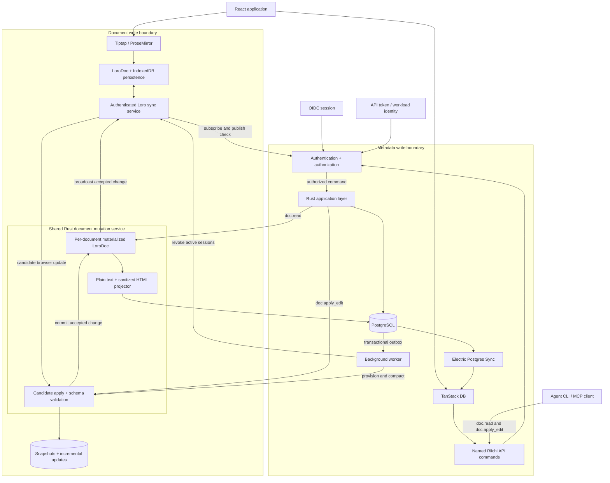

# Riichi document and metadata sync RFC

**Status:** accepted design; local implementation and verification complete, rollout gates pending  
**Scope:** post-pilot write architecture for collaborative documents and
structured application state  
**Related:** [pilot architecture RFC](./riichi-pilot-architecture-rfc.md),
[project hierarchy](./project-hierarchy.md)

## 1. Decision summary

Riichi will have two write systems separated by an explicit ownership boundary:

1. **Loro owns live document content.** This begins with issue descriptions
   and later includes team, project, and standalone Notion-style documents.
2. **PostgreSQL owns structured application state.** Electric Postgres Sync and
   TanStack DB replicate that state into the browser and provide reactive reads
   and optimistic UI. Named Riichi API commands remain the only metadata write
   path.

A shared Rust document mutation service is the only server-side component that
materializes or changes a Loro document. Human WebSocket updates, agent document
commands, projections, provisioning, and compaction all use this service. It is
a module inside the modular monolith initially, not another deployable.

Before Loro is introduced, the same document-content interface is backed by a
versioned PostgreSQL snapshot store. This lets Riichi ship document navigation,
permissions, attachments, and links without making the CRDT format a product
dependency before the compatibility spike passes.

The two systems do not share field ownership. A field is either document state
or metadata state. No client writes directly to PostgreSQL, and a Loro
document cannot change leases, permissions, issue status, approvals, or any
other dispatch invariant.

Loro is selected subject to a compatibility and reliability spike against
Riichi's real Tiptap schema. Automerge is the fallback if Loro fails the rich
text, multi-tab identity, authorization, or recovery gates in this RFC.

The compatibility spike must prove both browser binding and native Rust
projection. The existence of a ProseMirror binding is not by itself evidence
that the Rust service can validate, project, and recover Riichi documents.

This RFC selects Electric and TanStack DB for the first metadata sync
implementation. Replicache remains the fallback if durable offline metadata
mutation replay becomes a near-term product requirement.

## 2. Context

The pilot has one write path for issue title, description, status, importance,
labels, dispatch eligibility, specification state, and rank. The browser sends
a versioned `PATCH`; PostgreSQL validates the mutation, increments the issue
version, writes an audit record, and enqueues an outbox event in one
transaction. Server-sent events tell browsers to refetch authoritative state.

That design protected the pilot's lease and authorization invariants, but it
does not support concurrent rich-text editing. A debounced description save
still replaces one server value. Concurrent editors can reject each other or
overwrite work, and offline edits have no merge semantics.

The metadata side has different needs. Status, approval, lease, hold, and role
changes are domain decisions. They require server authorization, current-state
validation, idempotency, fencing, and transactional audit. CRDT merge semantics
would make those rules harder to explain and less safe.

The post-pilot architecture therefore needs two kinds of local-first behavior:

- convergent collaborative editing for document content;
- reactive local reads and optimistic, server-arbitrated commands for metadata.

## 3. Goals

- Allow multiple people to edit an issue description concurrently.
- Allow authenticated agents to read and edit documents through named HTTP
  commands without implementing the Loro wire protocol.
- Preserve edits through temporary disconnection and reconnect.
- Reuse the document architecture for future team, project, and standalone
  documents.
- Make metadata reads reactive and locally queryable without weakening Riichi's
  server-side domain rules.
- Keep leases, approvals, permissions, holds, and audit authoritative in
  PostgreSQL.
- Give agents, search, exports, and notifications a bounded server-side view of
  document content.
- Provide useful team and project documents without committing to a full
  database-style workspace or block system.
- Support incremental migration from the current API and TanStack Query code.
- Make ownership, recovery, testing, and operations explicit at the boundary.

## 4. Non-goals

- Peer-to-peer synchronization between end-user devices.
- Offline lease claims, approvals, takeovers, or other time-sensitive commands.
- One transaction spanning Loro history and PostgreSQL metadata.
- Collaborative editing of issue titles or metadata fields.
- Arbitrary embeds, database-style blocks, formulas, synced blocks, or a
  complete Notion-style block system in the first slice.
- Replacing the Rust application layer with generic row mutation endpoints.
- Treating browser state as authoritative.

## 5. Ownership boundary

### 5.1 Loro-owned state

| Resource | Loro content |
| --- | --- |
| Issue | Description rich text |
| Team | Future documentation pages |
| Project | Future documentation pages |
| Document | Future title-independent page content and block tree |

Loro documents may contain rich text, movable lists, movable trees, marks,
links, and stable block identifiers. Presence, cursors, and selections use
Loro's ephemeral store and are not part of durable document history.

Issue descriptions will use Loro's rich-text model and official ProseMirror
binding. Tiptap remains the editor UI because it is built on ProseMirror and is
explicitly supported by the binding. We will not store the whole HTML document
in one Loro map value; that would turn concurrent editing back into
whole-value replacement.

Movable lists and trees are the intended basis for future block documents. The
first issue-description schema remains smaller and only enables structures the
current editor can round-trip safely.

### 5.1.1 Schema-version rollout

Every durable document snapshot, version, projection, HTTP update, and
WebSocket hello carries a schema version. The implementation supports schema
versions 1 and 2 and fails closed on an incompatible version. A client must not
silently reinterpret a snapshot from another schema.

Before introducing schema version 2, the server must support a transition
window with these properties:

1. the v1 and v2 validators and projection fixtures run side by side;
2. a document migration materializes the v1 snapshot, applies a deterministic
   transformation, writes a v2 snapshot and projection in one transaction, and
   preserves the v1 history for audit and recovery;
3. the sync handshake negotiates the document version and returns a typed
   upgrade-required error to v1 clients after the migration barrier;
4. the API keeps a bounded read-only projection path for clients that cannot
   upgrade immediately; and
5. rollback restores the pre-migration snapshot and projection together, with
   the same frontier and binding verification used by a database restore.

The repository now has a bounded v2 transition fixture. v2 adds validated
`callout` blocks, and the deterministic v1 migration maps blockquotes to
informational callouts. The migration archives the prior Loro snapshot,
frontiers, and schema version, writes the v2 snapshot, version, projection,
and references in one PostgreSQL transaction, and leaves the existing resource
bindings intact. The API WebSocket test exercises a v1 rejection and v2
snapshot handshake against a populated document. The browser session also has
an explicit v2 protocol mode, and v2 is now the default for new documents and
browser sessions. Existing v1 documents remain v1 until they are migrated
through the explicit schema operation. The same boundary exposes an
atomic rollback operation that archives the v2 snapshot, restores the v1
snapshot and projection, and rechecks both protocol directions.

### 5.2 PostgreSQL-owned state

PostgreSQL remains authoritative for:

- organizations, teams, projects, memberships, roles, and invitations;
- issue identity, display key, title, team ownership, and project attachment;
- lifecycle status, importance, rank, labels, assignee, and agent eligibility;
- sub-issues, issue edges, holds, specification state, and triage state;
- leases, claims, sessions, collaborator grants, fencing tokens, and recovery;
- approvals, notifications, comments, activity, audit, idempotency, and outbox;
- document registry, resource bindings, access policy, and materialized
  document projections.

Comments remain append-only domain records. Their bodies may use sanitized rich
text, but comments are not live collaborative documents in this RFC.

### 5.3 Why the issue title stays metadata

Titles appear in lists, filters, notifications, search results, agent claims,
and external integrations. They are short values with useful last-writer or
optimistic-version semantics. Keeping them in PostgreSQL avoids loading a CRDT
document to render every issue row and keeps list projections coherent.

### 5.4 Why Loro

Loro fits both the first description editor and the later document roadmap:

- its official ProseMirror binding explicitly supports Tiptap;
- movable lists and movable trees provide merge semantics for reordered and
  nested blocks;
- the native Rust crate and WASM package allow the browser and Riichi services
  to use the same document format;
- frontiers, checkout, forks, and shallow snapshots support reproducible
  projections, history, and retention.

The tradeoff is more application-owned infrastructure. Unlike Automerge Repo,
Loro does not supply Riichi's repository, transport, authentication, or storage
service. Riichi must also enforce strict peer-ID lifecycle rules. Phase 0 tests
these costs before the format becomes durable production data.

## 6. Architecture



### 6.1 Pre-CRDT document product slice

Before introducing collaborative CRDT content, Riichi should establish the
document resource model and its user-facing value. This slice is deliberately
metadata-first. It provides team and project pages, nested pages, permissions,
attachments, and links to Riichi resources while leaving the content backend
behind a replaceable boundary.

The first document experience supports:

- rich text appropriate for specifications, runbooks, briefs, and notes;
- headings, paragraphs, lists, quotes, code blocks, mentions, and external
  links;
- image and file attachments;
- inline links to issues, projects, teams, and other documents;
- backlinks for resources referenced by a document;
- nested pages with a bounded depth or item count;
- plain-text search over a server-side projection.

It intentionally excludes database-style blocks, formulas, kanban blocks,
arbitrary embeds, synced blocks, and transclusion. Those may be added later as
new schema capabilities after the document model and synchronization boundary
have proven stable.

Document titles, hierarchy, ownership, permissions, attachment metadata, and
resource references are PostgreSQL metadata. Document content remains behind a
document-content interface so the initial editor/storage implementation can be
replaced by Loro without changing document navigation or authorization.

The pre-CRDT content implementation stores versioned ProseMirror/Tiptap JSON,
not HTML. Each accepted version also stores a bounded plain-text projection and
sanitized HTML projection. The current issue body is HTML, so its migration is
an explicit import and sanitization step rather than a blind column rename.

Every document has one canonical owner scope:

- an organization-owned document has no team or project owner;
- a team-owned document has exactly one owning team;
- a project-owned document has exactly one owning project.

Bindings to issues, teams, projects, and other documents describe how a
resource uses or references a document. They do not create additional owners or
silently widen permissions. Team-owned documents use team membership for their
default human permissions. Project-owned documents use direct project
membership. Organization-owned documents use organization membership. The
`project_teams` relationship does not implicitly grant access to project
documents. Issue-description bindings delegate to the existing issue access
policy because an issue may be reachable through its owning team or an attached
project.

Attachments are uploaded through an API-issued upload session. PostgreSQL owns
the attachment metadata and authorization, while the bytes live in local
development storage or an S3-compatible object store. A document stores only a
stable attachment identifier and presentation metadata. The editor and CRDT
transport never carry the file bytes.

The upload session is resumable only within a bounded lifetime. An attachment
is not downloadable or referenceable until its declared size and checksum have
been verified and its state is `ready`. The server generates the object key;
clients never provide storage paths. Attachment access is checked through the
document or resource that references it. Malware scanning can add a
`quarantined` state later without changing the document format.

Riichi links use stable resource identifiers rather than opaque URLs. An inline
link records a resource type and ID, allowing renamed resources, permission
checks, previews, and backlinks without rewriting document content:

```json
{
  "type": "riichiLink",
  "resourceType": "issue",
  "resourceId": "019f5942-ba13-7153-be85-59ee672d6b6c",
  "label": "RII-42"
}
```

The first implementation can render ordinary links and inline Riichi links.
Block-level related-resource sections, rich previews, and cross-document
transclusion remain later capabilities.

References and attachment associations are derived from the accepted document
version. The extractor records the source block or node identifier, so removing
an inline link removes its backlink without deleting the target resource.

### 6.2 Document path

The browser opens a Loro document through a stable application binding, not a
user-supplied storage key. An authenticated sync endpoint resolves the binding,
authorizes the current principal, and joins the document sync stream.

The browser stores a Loro snapshot and incremental updates in IndexedDB through
Riichi-owned persistence code. Edits apply locally, then synchronize over
WebSocket when a connection is available. The first transport handshake sends
a durable binary snapshot and then broadcasts binary updates; frontier-aware
missing-update exchange is a follow-up optimization. Loro converges once peers
have received the same operations.

The server stores an append-only sequence of accepted updates plus periodic
snapshots. It compacts updates into a current snapshot and can use shallow
snapshots when the retention policy allows older history to move to cold
storage. Checksums are validated before imported data reaches shared state.

The first deployment uses a central sync service. Loro supplies document,
version, import, and export primitives, while Riichi owns transport, persistence,
authentication, backpressure, and reconnection. Peer-to-peer transport can be
evaluated separately later.

Every active browser `LoroDoc` instance uses a random peer ID. Riichi does not
derive a peer ID from a user, device, or document. It does not reuse peer IDs
across tabs or restored sessions. Reusing one peer ID concurrently can create
duplicate operation IDs and irreparable replica divergence.

### 6.3 Shared document mutation service

The document mutation service owns one logical materialized `LoroDoc` for each
active document. It serializes accepted changes for that document. The first
deployment can keep these runtimes in one process; later deployments must route
a document to one logical runtime or introduce equivalent per-document
coordination.

Both the sync service and Rust application layer call the same operations:

- load a document from its latest snapshot and accepted updates;
- apply an incoming update to an isolated candidate document;
- validate checksum, schema, size, and resource limits;
- persist an accepted update and its attribution envelope before broadcast;
- update the active replica and broadcast the accepted update;
- derive plain-text, sanitized-HTML, and structured projections;
- initialize, compact, archive, and restore document history.

Projection and validation share the same materialized representation. Schema
validation is not a stateless inspection of opaque update bytes.

The accepted-update envelope records the authenticated principal, Loro peer ID,
previous and resulting frontiers, source, update identity, optional command
idempotency key, and timestamp. A server runtime peer ID identifies the runtime
session that emitted a Loro change; it is not sufficient agent attribution. The
authenticated command and accepted-update envelope provide that attribution.

### 6.4 Agent document path

Agents use authenticated HTTP commands rather than the Loro WebSocket protocol:

- `doc.read` returns structured content, stable block identifiers, the current
  frontiers, and a bounded human-readable representation;
- `doc.apply_edit` accepts an idempotency key, base frontiers, and structured
  operations against stable blocks or text anchors;
- an explicit whole-document import may accept Markdown for document creation
  or replacement, but Markdown replacement is not the default edit primitive.

The application layer authenticates the workload identity, authorizes the
document capability, and passes the principal and command to the document
mutation service. The service translates accepted operations into Loro changes,
persists attribution, projects the result, and broadcasts it to human editors.
Stale base frontiers return a typed result with the current frontiers and enough
state for the agent to re-read and retry intentionally.

### 6.5 Metadata read path

Electric streams authorized PostgreSQL shapes to TanStack DB. Components read
from TanStack DB live queries instead of assembling server state through route
specific fetches. The shape boundary is scoped by organization and membership;
the browser never supplies unrestricted table or predicate parameters.

Electric is a read-path sync engine. It does not become a second application
server and does not accept domain writes.

### 6.6 Metadata write path

TanStack DB applies an optimistic transaction and invokes a named mutation
handler such as:

- `rename_issue`;
- `change_issue_status`;
- `set_issue_importance`;
- `attach_issue_to_project`;
- `add_issue_label`;
- `approve_operation`.

The handler calls the existing Rust API. The Rust application authenticates,
authorizes, validates expected state, and executes the same PostgreSQL
transaction used today. The response includes the domain result and a database
transaction marker. The client keeps the optimistic state until that transaction
appears on the Electric stream. A rejection rolls back the optimistic state and
shows the typed domain error.

Generic `update row` or `PATCH arbitrary fields` sync endpoints are forbidden
for guarded domain state. Commands may share transport plumbing, but their
meaning stays explicit.

### 6.7 Commands that require a live connection

The UI must require server confirmation for:

- lease claim, renewal, release, and takeover;
- approval decisions;
- permission and membership changes;
- recovery confirmation;
- integration operations with external side effects;
- destructive operations whose authorization may have changed.

These commands can render optimistically only when reversal is unambiguous.
They are never queued for blind replay after a long offline period.

## 7. Document registry and projections

PostgreSQL needs a registry without owning production Loro content. During the
pre-CRDT phase it also stores versioned temporary content behind the document
content interface. The logical model is:

```text
documents
  id
  organization_id
  kind
  title
  parent_document_id
  position
  owner_team_id       # nullable; mutually exclusive with owner_project_id
  owner_project_id    # nullable; organization-owned when both are null
  provisioning_state
  created_by
  created_at
  updated_at
  deleted_at

document_bindings
  document_id
  resource_kind
  resource_id
  role

document_versions
  document_id
  revision
  content              # versioned ProseMirror/Tiptap JSON during pre-CRDT phase
  plain_text
  sanitized_html
  schema_version
  created_by
  created_at

attachments
  id
  organization_id
  state                # pending, ready, quarantined, deleted
  storage_key
  filename
  media_type
  byte_size
  checksum
  uploaded_by
  created_at
  completed_at
  deleted_at

attachment_uploads
  id
  attachment_id
  expected_byte_size
  expected_checksum
  expires_at
  cleanup_claimed_at
  completed_at

document_references
  document_id
  source_block_id
  resource_kind
  resource_id
  reference_kind
  created_at

document_attachments
  document_id
  attachment_id
  source_block_id
  created_at

document_projections
  document_id
  content_revision     # pre-CRDT revision or Loro frontiers after migration
  plain_text
  sanitized_html
  schema_version
  projected_at

document_jobs
  id
  document_id
  job_type
  idempotency_key
  available_at
  claimed_at
  attempt_count
  completed_at
  last_error
```

`owner_team_id` and `owner_project_id` are foreign keys with a database check
that permits at most one. The organization is the implicit owner when both are
null. `parent_document_id` must remain in the same owner scope during the first
slice. `position` is a server-assigned sibling ordering value; UUID order is
not a navigation policy. Document URLs use document IDs, so renaming a page
does not invalidate links.

`document_bindings` and the polymorphic resource references need uniqueness
constraints in addition to application checks. An issue may have one
description binding, while a document may contain many references to distinct
resources and source blocks. There are no cross-table foreign keys for the
polymorphic resource IDs; the application validates their organization and
authorization.

The durable document store records each accepted update with an update id,
document id, source, authenticated principal, peer id, optional command
idempotency key, previous and resulting frontiers, payload checksum, and
acceptance time. This envelope is stored with the update regardless of whether
document bytes live in PostgreSQL or object storage.

An issue has exactly one description binding. Team and project pages can have
many document bindings without changing the issue schema. A document may
reference any authorized issue, project, team, or document through
`document_references`; the referenced resource does not become owned by the
document.

Document hierarchy is represented by `parent_document_id` and is scoped to the
organization. The API enforces cycle prevention and bounded traversal. A
document's effective permissions come from its owning team or project in the
first slice. Per-page overrides can be added later if the inherited model is
too restrictive.

Attachment metadata is separate from document content. Upload completion must
verify the declared size and checksum before an attachment can be referenced
by a document. `document_attachments` is a projection of accepted document
content, not a client-controlled permission grant. Unreferenced ready uploads
are eligible for a later garbage-collection pass; pending or quarantined
uploads expire through the upload-session job. Expired upload cleanup claims
the database row before deleting the physical object, then finalizes metadata
only after the delete succeeds. Claims older than five minutes are reclaimable
after a worker interruption.

The existing `outbox_messages` table remains the project-scoped delivery path
for browser invalidation and agent events. Document provisioning, projection,
compaction, archival, and upload cleanup use `document_jobs` so organization,
team, and standalone documents do not get forced into project scope or decoded
as issue delivery events by the current worker.

The first durable Loro implementation stores snapshots and accepted updates in
PostgreSQL. An object-store adapter may move large snapshots or update batches
later, but the metadata, update envelope, and recovery protocol do not depend
on that migration.

The projector checks out the current versioned snapshot or stable Loro
frontiers and derives bounded server-side representations:

- plain text for agent context, search, notifications, and accessibility;
- sanitized HTML for email, exports, and non-collaborative rendering;
- serialized frontiers and a schema version for freshness checks.

Projections are caches. Loro history owns document content. If a projection
is missing or stale, it can be rebuilt from the document store.

## 8. Cross-boundary consistency

PostgreSQL and Loro storage cannot participate in one useful ACID
transaction. Cross-boundary workflows use stable identifiers, idempotent jobs,
and visible provisioning state.

### 8.1 Issue creation

1. The API creates the issue and document registry row in PostgreSQL.
2. The same transaction writes a unique `document_jobs` provisioning job.
3. The worker asks the document mutation service to create the initial Loro
   snapshot idempotently and marks the registry ready.
4. Until ready, the UI shows a retryable empty description state.

The inverse order is unsafe because a failed issue transaction would leave an
unowned document.

### 8.2 Deletion

Deleting a resource first tombstones its document binding in PostgreSQL. A
retention job later deletes or archives Loro data. The delay supports
undo, audit, and recovery.

### 8.3 Specification state

`spec_complete` records the projected Loro frontiers that a human or agent
reviewed. If the description moves to different frontiers, the issue exposes
`specification_changed_since_review`. It must not silently claim that an edited
specification is still the reviewed version.

Dispatch can require either:

- a projection at the recorded reviewed frontiers; or
- a newer projection plus an explicit policy that accepts post-review edits.

The first policy is the safe default.

### 8.4 Agent context

Context construction reads a document projection at named frontiers. The
context manifest records those frontiers alongside metadata versions. This
makes a dispatched context reproducible even if people continue editing the
description.

If the projector is behind, context construction waits for a bounded interval
or returns a typed `document_projection_pending` result. It does not silently
send stale or empty content.

### 8.5 Document maintenance

The background worker schedules idempotent provisioning, compaction, archival,
and deletion jobs. The document mutation service executes them through the same
per-document serialization used for edits.

Compaction folds accepted incremental updates into a new snapshot, verifies that
the snapshot has the same frontiers and projection as the pre-compaction state,
then removes or archives covered updates according to retention policy. A
failed compaction leaves the previous snapshot and updates readable.

## 9. Authorization and tenant isolation

- PostgreSQL bindings determine who may discover, read, or edit a document.
- A Loro storage key or frontier is an address, not an access token.
- The sync server authenticates the current Riichi session before opening a
  document and authorizes both subscription and publication.
- Active connections retain a versioned authorization grant. A membership,
  role, lease, or document-permission change emits an outbox event that closes
  affected sockets and requires authorization again on reconnect.
- Incoming updates are applied to an isolated candidate document first. The
  service validates checksum, schema, size, and resource limits before it
  persists or broadcasts the update.
- The service binds each connection's random Loro peer ID to the authenticated
  principal for attribution. The client cannot use a peer ID as proof of
  identity.
- Agent commands use API tokens or workload identity. Agent identity, lease, and
  document capability are checked before `doc.read` or `doc.apply_edit` reaches
  the mutation service.
- Organization id comes from the authorized binding, never from client input.
- Electric shapes are issued through an authenticated proxy or short-lived,
  shape-scoped token. Shape predicates are constructed server-side.
- Logging out removes user-scoped TanStack DB and Loro IndexedDB data.
- Permission revocation closes active document and shape streams and prevents
  later queued writes from being accepted.

The first version does not encrypt Loro content end-to-end. Riichi servers
must read descriptions for agent context, search, exports, abuse handling, and
recovery. Encryption at rest belongs to storage and deployment policy.

## 10. Audit and activity

Metadata mutations keep the current transactional audit and outbox behavior.
Document editing uses a different granularity:

- persist accepted Loro updates and peer-to-principal attribution for document
  history;
- emit activity for editing sessions or meaningful saved frontiers, not every
  keystroke;
- record the previous and new frontiers, principal, document id, and timestamp;
- generate human summaries asynchronously when useful;
- retain a raw history view for authorized users.

The accepted-update envelope is the durable attribution source. The projector
or worker writes its corresponding PostgreSQL activity record idempotently by
update id. This avoids pretending the document store and PostgreSQL share one
transaction.

The activity stream can combine metadata events and document-version events by
timestamp, but it must preserve their independent source cursors.

## 11. Electric versus Replicache

| Concern | Electric + TanStack DB | Replicache |
| --- | --- | --- |
| Server source | Streams filtered PostgreSQL changes | Custom pull endpoint materializes each client view |
| Client reads | Relational collections and live queries | Reactive key/value client view |
| Optimistic writes | TanStack DB transaction calls existing API | Named mutator runs locally, then at the server |
| Reconciliation | Wait for PostgreSQL transaction on the stream | Pull canonical state and replay pending mutators |
| Offline pending writes | Must be designed and persisted separately | Built into the client mutation log |
| Riichi backend work | Add shape auth and transaction markers | Implement push, pull, cookies, mutation ordering, and view diffs |
| Fit with current stack | Direct fit with PostgreSQL, React, and TanStack | Good semantic fit, larger server protocol addition |

### Decision

Adopt Electric Postgres Sync plus TanStack DB first.

This choice preserves the existing PostgreSQL model and Rust command handlers,
is incrementally adoptable, and removes most refetch and cache-coordination code.
It also avoids building a custom per-user pull protocol before the product has a
clear need for offline metadata mutation.

Replicache is the preferred alternative if product requirements change to make
durable offline metadata writes central. Its persisted mutation log and replay
model are stronger than inventing the same machinery beside Electric. Before
adding a homegrown durable mutation queue, revisit this decision.

The boundary above is deliberately independent of the choice. Named commands,
PostgreSQL authority, and no direct row writes apply to either engine.

## 12. Failure and recovery behavior

| Failure | Required behavior |
| --- | --- |
| Browser loses network while editing description | Continue locally; merge after reconnect; show sync state |
| Browser loses network during metadata command | Keep a clearly pending optimistic value only for commands allowed by policy; otherwise roll back and ask for retry |
| Metadata command is rejected | Roll back dependent optimistic state and show the typed reason |
| Electric stream is delayed | Keep the mutation pending until its transaction marker arrives or a timeout triggers authoritative reconciliation |
| Loro sync service restarts | Reload the snapshot and accepted updates, then resume sync without data loss |
| Document runtime crashes after persistence but before broadcast | Reload the accepted update and broadcast it during catch-up; do not create another change |
| Agent edit uses stale frontiers | Reject or return a typed rebase result; require an intentional re-read and retry |
| Projection worker fails | Retry idempotently; expose projection lag; do not alter document history |
| Document provisioning fails | Keep visible failed state and retry from outbox |
| Permission is revoked while offline | Reject later sync, purge inaccessible local caches, and surface the revocation |
| One store restores without the other | Run binding and projection verification before reopening writes |

## 13. Migration plan

### Phase 0 implementation status

The first native compatibility slice is now present in the application crate.
`riichi_application::loro_document::LoroDocument` can hydrate the current
Tiptap JSON schema into a Loro document, preserve text leaves as Loro text
containers, export snapshots and deltas, import updates, and derive the same
plain-text and sanitized-HTML projections used by the pre-CRDT store. The
accepted-update DTO records the document, authenticated principal, source,
payload checksum, previous frontiers, resulting frontiers, and timestamp.

The native adapter is now paired with the browser Loro/ProseMirror binding,
scoped IndexedDB persistence, and an authenticated WebSocket transport. The
browser opens a persistent session, imports the durable snapshot, relays local
updates, applies remote updates, and reconnects by receiving a fresh snapshot.
The compatibility fixture covers the current editor schema, including
headings, paragraphs, marks, links, mentions, hard breaks, bullet and ordered
lists, task lists, blockquotes, code blocks, horizontal rules, and attachment
images. Native projection and sanitization handle task-list nodes rather than
silently dropping them.
The current Rust adapter also exposes a small path-based text insertion
operation for exercising the boundary; it is not the final editor operation
protocol.

The API now exposes an authenticated snapshot endpoint that initializes or
loads the durable current Loro snapshot and returns a browser-loadable snapshot
plus frontier metadata. Explicit historical revision reads remain a
non-durable compatibility path. The API also exposes an authenticated HTTP
apply command with base64 payload transport, server-owned principal/source
attribution, frontier checks, and idempotent replay.

The durable store currently keeps the latest snapshot alongside every accepted
update in PostgreSQL. The WebSocket path uses a central per-document fan-out
registry backed by PostgreSQL notifications, server-owned frontier selection,
bounded retry on contention, binary update frames, and snapshot catch-up after
a receiver falls behind. Accepted Loro updates update the versioned content and
projection rows in the same transaction as the Loro snapshot, so legacy reads
remain current during migration. The browser adapter atomically stores
snapshots with pending updates, replays pending updates after an interrupted
snapshot save, serializes dependent sends, and debounces local snapshot
compaction.

The document editor now mounts the Loro/ProseMirror binding when the Loro
session is available. The versioned content API remains a compatibility read
bridge for legacy rows, while the general issue metadata command no longer
accepts `body`. Existing unbound descriptions are shown read-only until their
document binding is repaired.

### Current implementation checkpoint

The repository now has the first end-to-end boundary for both stores:

- issue metadata is projected into `issue_metadata_sync` by PostgreSQL triggers
  over issue, dispatch-rank, and label changes;
- all human-accessible issue queue rows are projected into the account-scoped
  `human_issue_sync` read model. The global and team issue hooks use its
  Electric shape when enabled and retain the authenticated API as fallback;
- the API exposes an authenticated, project-scoped Electric shape proxy that
  pins the table and tenant predicate server-side and forwards only Electric
  protocol parameters;
- the web collection is opt-in behind `VITE_ELECTRIC_SYNC_ENABLED`, uses the
  same-origin proxy, and keeps TanStack Query as its fallback. Named issue
  mutations return a trigger-captured PostgreSQL transaction marker and wait
  for the matching replicated version and marker before resolving;
- issue title, status, importance, and specification controls use TanStack DB
  optimistic updates when their replicated row is available. The collection
  handler calls the named issue API, waits for the matching transaction marker,
  and lets TanStack DB roll back typed rejections; an authoritative API path is
  retained while a row is still loading;
- issue activity is now materialized in `issue_activity_sync` from comments,
  issue audit records, and accepted document edits. The existing activity API
  reads that projection, and an authenticated Electric shape is available for
  the issue detail surface;
- human navigation is now materialized in `navigation_sync` per account from
  active organization, team, and project relationships. Membership, naming,
  emoji, logo, and project-role changes refresh the affected rows. The web
  navigation hook reads this shape when Electric is enabled and falls back to
  the existing authenticated navigation API otherwise;
- human document navigation is now materialized in `human_document_sync` per
  account from the same document-access predicate as the document API. Team
  and project resource pages and document relationship discovery use this
  shape when Electric is enabled, while the bounded document-list APIs remain
  the fallback during rollout. The organization documentation route now
  exposes standalone organization-owned pages through the same tree, editor,
  and binding boundary;
- the team agent roster is now materialized in `human_agent_sync` per account
  and role, including a bounded session list. The roster page uses the
  account-scoped team shape when Electric is enabled and retains the existing
  authenticated roster API as fallback; role, session, and membership changes
  refresh the projection transactionally;
- the human approval queue is now materialized in `approval_sync` per account
  from pending requests and active project-admin memberships. Approval state,
  issue title, project changes, and membership changes refresh the projection,
  and the approval route uses its Electric collection with the existing API as
  fallback;
- accepted Loro updates have a durable activity read model with principal and
  frontier attribution, and compaction does not erase that activity;
- agent context can request a stored document frontier. Unknown or compacted
  frontiers return `document_frontier_unavailable` instead of silently serving
  current content.

This checkpoint does not claim the RFC is fully complete. The compatibility
matrix now records real Chromium clipboard coverage and the v1/v2 schema
transition, and `just test-populated-restore` exercises a dataful PostgreSQL
dump/restore
with issues, documents, Loro snapshots and updates, activity, attachments,
approvals, notifications, and all current sync projections. The same storage
contract is exercised against a real MinIO S3-compatible service by
`just test-s3-storage`, including object-prefix backup and restore. The
remaining work is mobile rollout evidence and the target-deployment replication
authorization and operational gates before retiring SSE as the fallback. A
reproducible local Electric service and shape smoke test now exist through
`just start-electric` and
`just test-electric-local`; this proves service readiness and the real
`human_issue_sync` shape against a fresh logical-replication database. The
authenticated proxy test also proves that
unauthenticated requests and non-member project requests are rejected before
the upstream shape is queried. Local signed-in browser verification now covers
the authenticated navigation, document, and issue shapes: the Electric-enabled
app opened a new document, reported `Document synced`, rendered its real
document URL in the team tree, and rendered real issue URLs in the
status-grouped queue. This still does not establish target-deployment telemetry
or production deployment behavior.
The browser e2e suite now reproduces that path with Testcontainers: it starts
PostgreSQL with logical replication enabled, starts Electric on the same
container network, runs the authenticated API proxy and Vite app, and verifies
queue rendering, filtering, issue mutations, document editing, and the agent
roster with `VITE_ELECTRIC_SYNC_ENABLED=true`.
The repository also includes an operator probe that records Electric health,
shape rows, response bytes, snapshot latency, cursor state, and pending WAL
bytes for logical replication slots. It is read-only and uses the fixed,
account-scoped human issue shape.
The probe has also been run against the local Docker Electric deployment with
an authenticated account-scoped shape, active replication slot, response-size,
and latency output. This is deployment-shaped local evidence; the target pilot
deployment still needs its own baseline and revocation exercise.
Active Electric shape streams now fail closed on human access changes. Membership
and human-session triggers publish account-scoped access events; the API closes
matching streams immediately and rechecks the session and project permission
once per second, closing on a failed or denied check. The ignored PostgreSQL API
integration test `electric_project_shape_closes_after_membership_revocation`
proves the held project shape closes after a real membership revocation.
The browser Loro protocol test also purges the revoked document's scoped
IndexedDB snapshot and pending updates when the server sends the typed
revocation error. Reconnect performs an authorized document preflight, so an
offline revocation purges local state even when the WebSocket upgrade itself is
rejected; transient network failures continue with bounded backoff.
Logout now disposes active Loro sessions before clearing the shared IndexedDB
document store, cleans every registered TanStack DB collection, and clears the
TanStack Query cache before navigating to login. The browser unit coverage
exercises collection cleanup, failure isolation, and document-store purging.
The legacy description write path has been removed
from the general issue metadata command; the legacy body column remains
read-only for projection compatibility.

Attachment bytes now use a shared `riichi-storage` object-store boundary. Local
filesystem storage remains the default, and the same API/worker contract can be
configured for S3-compatible storage through environment variables. The local
backend is included in the populated restore drill; S3 restore evidence remains
a deployment-specific gate.

### Current completion audit

The local implementation and CI evidence currently establish:

- the v1/v2 schema boundary at native, HTTP, WebSocket, and IndexedDB layers;
- a transactional v1-to-v2 migration with archived snapshot/frontier history,
  preserved document bindings, and real PostgreSQL/WebSocket coverage;
- browser clipboard behavior through real Chromium with structured HTML and
  plain-text fallback data;
- PostgreSQL concurrency and isolation suites running in CI with real
  testcontainers databases;
- a dataful PostgreSQL backup/restore drill that verifies Loro snapshots,
  updates, bindings, projections, activity, attachments, approvals,
  notifications, account-scoped sync rows, and local attachment bytes;
- a real MinIO S3-compatible round trip with object-prefix backup and restore;
- a managed S3-compatible restore harness that reuses deployment attachment
  settings, refuses managed bucket creation, isolates writes under a unique
  prefix, and cleans that prefix after the check;
- Electric readiness, real shape delivery, authenticated proxy authorization,
  tenant predicates, fallback behavior, and local signed-in browser replication
  for navigation, documents, and the issue queue, with a repeatable
  Testcontainers-backed Chromium suite covering the same Electric path, plus
  a read-only shape and replication-lag observability probe;
- organization documentation navigation and standalone page creation through
  the authenticated API, real Electric-backed navigation, and Loro editor
  mount in the Testcontainers-backed Chromium suite;
- optimistic issue metadata commands with transaction-marker acknowledgement,
  rollback behavior, API fallback, and real Chromium coverage for status and
  importance changes;
- active project-shape revocation in a real PostgreSQL API integration test,
  backed by database access-event notifications and fail-closed session and
  project authorization rechecks in the Electric proxy.
- logout cache hygiene that disposes active document sessions, clears replicated
  collections and Loro IndexedDB state, and removes the TanStack Query cache.

The RFC remains in rollout-gate status until the v2 editor surface has been
rolled out intentionally, rich-text composition has been exercised on
a real mobile client, Electric deployment telemetry and signed-in browser
replication have been verified in the target deployment, and attachment
object-storage restore has been exercised alongside PostgreSQL restore, and a
mixed-version client pair has passed the migration barrier. Local filesystem
and MinIO-compatible storage are covered; the target managed object-store
deployment still needs its own restore evidence.

### Rollout gate register

| Gate | Current evidence | Required proof to close it |
| --- | --- | --- |
| v1 to v2 document migration | v2 callouts, deterministic blockquote migration, archived v1/v2 snapshot/frontiers, atomic rollback, preserved bindings, populated PostgreSQL/WebSocket v1/v2 coverage, and a production-shaped restore | v2 is the default for new documents and browser sessions; migrate existing v1 documents explicitly and retain rollback history |
| Mobile composition | Chromium desktop clipboard and editor paths pass; no mobile Riichi client exists | Run the same rich-text schema through a real mobile client and IME, including composition interruption, paste, reconnect, and persistence |
| Target Electric deployment | Local Electric health/shape smoke, authenticated proxy authorization, active project-shape revocation, and repeatable Testcontainers-backed signed-in Chromium replication for navigation, documents, and the issue queue pass | Capture the same signed-in replication plus shape rows/bytes/lag/ack telemetry, permission revocation, and API fallback behavior in the deployment that will receive pilot traffic |
| Managed object storage | Local filesystem and real MinIO S3-compatible round trip plus prefix restore pass; `just test-managed-s3-storage` provides the managed-store check without creating a bucket | Run the populated PostgreSQL restore and object-prefix restore against the managed store, then compare every ready attachment's size and checksum before reopening writes |
| Mixed-version clients | Native and protocol-level v1/v2 validation, rejection, migration, and rollback tests pass; no older deployed browser/client pair exists | Exercise an older client against the migrated server and verify the bounded read-only compatibility path before enabling the migration barrier |

### Phase 0: prove the rich-text binding

- Build a small Tiptap and Loro ProseMirror compatibility spike.
- Cover the exact schema Riichi uses: paragraphs, headings, lists, links, code,
  mentions, and any custom nodes already in production.
- Verify concurrent structural edits, schema upgrades, copy/paste, undo, and
  mobile composition input.
- Verify that random peer IDs remain unique across tabs, reloads, restored
  sessions, and imported snapshots.
- Reject duplicate active peer IDs at the sync boundary and verify that the
  current browser editor schema round-trips through both browser binding and
  native projection.
- Measure WASM transfer size, document load time, update size, and Rust-side
  projection cost against representative issue descriptions.
- Prove that the Rust-side representation can validate the chosen schema and
  derive the same plain-text and sanitized-HTML projections as the browser.
- Stop if unsupported Tiptap extensions cannot round-trip without data loss.
- Fall back to Automerge if the spike cannot satisfy the rich-text, identity,
  authorization, or recovery gates without fragile application code.

The current phase-zero evidence includes the native schema round-trip fixture,
browser binding coverage for the same nodes, browser persistence/replay and
reconnect tests, real API WebSocket fan-out, duplicate-peer, and active-
permission-revocation tests, and a fresh-server restart recovery test. There
is no mobile Riichi client yet, so mobile composition remains an explicit
pre-mobile-client gate rather than an unverified claim of support. Copy/paste
and mixed-version schema coverage are covered for the current desktop and
protocol clients; v2 is the default for new documents and browser sessions,
while existing v1 documents remain explicitly versioned until migrated. Native
shallow-snapshot recovery also
preserves the materialized state and accepts new updates after recovery; the
PostgreSQL migration test covers the archived-history half of that path.
The detailed current compatibility record is in
[the write-boundary compatibility matrix](./riichi-write-boundary-compatibility.md).

### Phase 1: establish the document resource shell

- **Implemented:** document, binding, reference, attachment, upload-session,
  and document-job metadata tables.
- **Implemented:** team, project, and organization document navigation with
  nested pages.
- **Implemented:** inherited permission checks for discover, read, create, edit,
  and delete.
- **Implemented:** upload sessions and local/S3-compatible attachment storage.
- **Implemented:** resource-link parsing, authorization-aware rendering, and
  backlinks.
- **Implemented:** bounded document-list and reference APIs for the web client.
- **Implemented:** versioned ProseMirror/Tiptap JSON content behind the
  document-content interface.
- Do not add database-style blocks, arbitrary embeds, or direct blob fields to
  document content.

### Phase 2: establish the CRDT document boundary

- Add the shared Rust document mutation service and per-document serialization.
- Add authenticated Loro sync and durable snapshot/update storage.
- Add browser IndexedDB storage and connection state.
- Provision one description document per issue.
- Import current issue HTML through sanitization and the versioned
  ProseMirror/Tiptap schema into Loro rich text.
- Keep the existing issue body column as a read-only projection during
  migration.

### Phase 3: move issue descriptions

- Read and edit descriptions through Loro.
- Remove `body` from the general issue metadata mutation. **Implemented:** the
  API rejects the legacy field and the browser only writes through the
  document boundary.
- Project plain text and sanitized HTML for server consumers.
- Update agent context, search, exports, notifications, and activity to name a
  set of document frontiers.
- Add `doc.read` and a bounded `doc.apply_edit` operation set for agents.
- Persist accepted-update attribution for both human and agent edits.
- Remove the legacy description write path after migration verification.
  **Implemented for writes:** legacy body reads remain until restored databases
  have passed projection verification.

### Phase 4: introduce metadata replication

- Add authenticated Electric shape endpoints for one read model, starting with
  the team issue list.
- Load the shape into TanStack DB and keep the current component interface.
- **Implemented:** named TanStack DB optimistic actions call the existing API
  through explicit issue metadata commands.
- **Implemented:** metadata commands return transaction markers and clients wait
  for them on the Electric stream.
- Move issue detail, projects, teams, notifications, and activity incrementally.
- The current implementation has moved issue metadata for project-scoped and
  account-scoped queue reads, issue activity, notifications, navigation,
  approvals, document navigation/resource discovery, and the team agent
  roster. Remaining secondary operational surfaces stay on the authenticated
  API fallback until their shape boundaries and projection contents are
  explicit.
- **Implemented for issue metadata commands:** replicated rows use named
  optimistic TanStack DB mutations with transaction-marker acknowledgement and
  rollback on typed rejection; unready rows use the existing API path.
- Retire equivalent SSE invalidation paths only after each read model has moved.
  **Implemented for issue queue reads:** the queue keeps SSE only when the
  Electric feature flag is disabled; the account-scoped issue shape is the
  reactive source when enabled.

### Phase 5: add collaborative general documents

- **Implemented:** replace the temporary content implementation with the
  validated Loro document backend.
- **Implemented:** team, project, and standalone document content using the
  same registry.
- **Implemented:** the first bounded collaborative block schema.
- **Implemented:** attachment and Riichi-link nodes in the validated rich-text
  schema.
- **Implemented:** document titles, hierarchy, permissions, and deletion policy
  remain in PostgreSQL.

## 14. Verification

### Document tests

- convergence under concurrent character, mark, and block edits;
- offline edits followed by reconnect in both orders;
- multi-tab editing with independent random peer IDs and shared local updates;
- schema migration and mixed-version clients;
- sync server restart, storage compaction, and projector restart;
- authorization on open, reconnect, and permission revocation;
- import from current Tiptap HTML without semantic loss;
- projection determinism for plain text and sanitized HTML;
- context construction pinned to Loro frontiers;
- concurrent human WebSocket and agent command edits;
- agent edit idempotency, stale frontiers, authorization, and attribution;
- runtime failure after persistence and before broadcast;
- compaction equivalence and interrupted-compaction recovery;
- duplicate peer-ID detection and rejection in adversarial tests;
- malformed, oversized, checksum-invalid, and schema-invalid updates;
- shallow-snapshot recovery with archived history (native shallow recovery plus
  the PostgreSQL schema-history migration path);
- document-job idempotency, retry, expiration, and recovery after worker
  interruption;
- upload completion, checksum mismatch, expiry, authorization, and orphan
  cleanup.

The Loro sync tests must use real documents, encoded updates, persistence, and
transports. Mocking the protocol would only prove the mock.

### Metadata tests

- optimistic success, typed rejection, rollback, and stream acknowledgement;
- concurrent edits from two clients and authoritative convergence;
- navigation projection grouping, membership revocation, resource renames, and
  account-scoped Electric predicates;
- document navigation projection visibility, nested hierarchy, content
  projection freshness, membership revocation, and account-scoped Electric
  predicates;
- approval projection visibility, decision removal, admin-role filtering, and
  account-scoped Electric predicates;
- stale expected versions and idempotent command retries;
- cross-organization and cross-team shape authorization;
- lease, approval, hold, and takeover commands while disconnected;
- transaction marker timeout and reconciliation;
- cache purge on logout or permission loss;
- migration routes that mix TanStack Query and TanStack DB reads.

### Boundary tests

- issue creation with delayed or failed document provisioning;
- description changes after specification review;
- dispatch while document projection is behind;
- resource deletion with unsynchronized document edits;
- backup restore with orphaned bindings or projections;
- activity ordering across metadata and document event cursors.

## 15. Operations and observability

Track at minimum:

- Loro connected clients, sync lag, bytes, updates, storage size, and
  compaction duration;
- active document runtimes, load latency, eviction count, and command queue
  depth;
- agent document command latency, stale-frontier rate, rejection rate, and
  idempotent replay count;
- rejected document updates by checksum, schema, size, and peer-ID policy;
- document provisioning failures and projection lag by organization;
- document-job backlog, retry, and dead-letter counts;
- Electric shape connections, replication lag, rows and bytes transferred;
- optimistic metadata mutation latency, rejection rate, rollback rate, and
  acknowledgement timeout rate;
- stale-specification and stale-context counts;
- orphaned document, binding, and projection counts.

Backups must include PostgreSQL and durable Loro snapshots and updates. Restore
drills must verify bindings, rebuild projections, and compare known frontiers
before traffic resumes. Retention and deletion jobs need separate policies for
metadata audit and document history.

## 16. Rollout gates

Issue descriptions can leave feature flagging only when:

- the rich-text schema passes concurrent-edit and migration tests;
- no tested disconnect or restart path loses acknowledged changes;
- authorization revocation works for active and reconnecting clients;
- human and agent edits converge with correct principal attribution;
- projections are deterministic and context can pin document frontiers;
- compaction has been exercised without changing frontiers or projections;
- backup and restore has been exercised.

Metadata replication can replace a read model only when:

- its Electric shape is tenant-safe;
- every optimistic command has rollback and typed rejection behavior;
- transaction acknowledgement is observable;
- the existing API path remains a working fallback during rollout.

## 17. Decisions and deferred questions

The pilot closes the following design questions:

- The stable editor schema includes paragraphs, headings, marks, bullet and
  ordered lists, task lists, blockquotes, code blocks, hard breaks, horizontal
  rules, links, mentions, and attachment images. Slash commands and editor
  chrome do not become document-schema dependencies.
- `doc.apply_edit` is intentionally bounded to frontier-checked text insertion
  by document node path and offset, with idempotency and server-side
  attribution. Agents use `doc.read` plus a fresh frontier for anything more
  complex; block moves, deletes, and arbitrary JSON patches remain deferred.
- References are extracted automatically from saved content. The explicit
  reference command remains available for repair and migration, but clients do
  not need to maintain a second reference payload during normal editing.
- PostgreSQL remains the durable store for Loro snapshots and updates during
  the pilot. The attachment object-store boundary is already available, while
  moving document history to object storage requires size and restore telemetry
  from real traffic first.
- Metadata commands are not durably queued offline. The browser may show a
  bounded optimistic value, but a disconnected command rolls back and asks
  the operator to retry.
- Description edits after specification review invalidate readiness and block
  dispatch until a human reviews the new frontier again.
- The server bounds document hierarchy depth at 32 levels and the web tree
  renders at most 8 levels at once. The pilot has no hard page-count quota;
  access-scoped list APIs, size limits, and operational metrics are the first
  guardrails.

The following remain production-policy gates rather than missing pilot
implementation:

- Production attachments require malware scanning before the `ready` state;
  the current pilot verifies authorization, expiry, size, and checksum and
  retains a `quarantined` state for the scanner boundary.
- The first production attachment adapter should be S3-compatible storage;
  local filesystem storage remains the development and single-node fallback.
- Pilot operational retention keeps document history available for recovery;
  a production deletion/archival period must be chosen with the operator after
  restore and usage data exist.
- The replication SLO is a target-deployment decision. The local contract is
  transaction-marker acknowledgement with authoritative API reconciliation,
  not a promise that every projection is immediately current.

## 18. References

- [Loro overview](https://www.loro.dev/docs)
- [Loro synchronization](https://www.loro.dev/docs/tutorial/sync)
- [Loro persistence](https://www.loro.dev/docs/tutorial/persistence)
- [Loro rich text and ProseMirror binding](https://www.loro.dev/docs/tutorial/text)
- [Loro peer-ID management](https://www.loro.dev/docs/concepts/peerid_management)
- [Loro ephemeral store](https://www.loro.dev/docs/tutorial/ephemeral)
- [Loro 1.0 architecture and shallow snapshots](https://www.loro.dev/blog/v1.0)
- [Automerge Repo fallback](https://automerge.org/docs/reference/repositories/)
- [Electric Sync](https://electric.ax/docs/sync/)
- [Electric write patterns](https://electric.ax/docs/sync/guides/writes)
- [Electric authorization patterns](https://electric.ax/docs/sync/guides/auth)
- [Replicache sync model](https://doc.replicache.dev/concepts/how-it-works)
